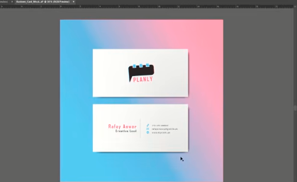

# Lecture#44

## Software: Adobe Illustrator - Activity - Branding - Creating a Business Card

- The first important thing is the Bussines Card size.
- The standard size of the Bussines Card is "3.5 by 2" inches, i.e (3.5 is tis width and 2 is its height).

# Output

   
  
