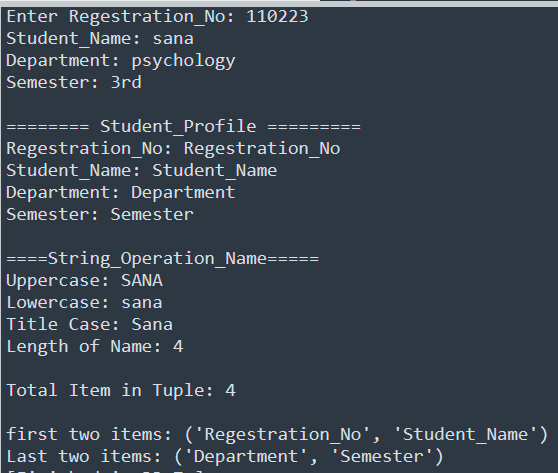

# Task-11

## I learned in lesson
1. Take input for:

   * Registration Number
   * Student Name
   * Department
   * Semester
2. Store all information in a tuple.
3. Display the complete profile.
4. Display each item separately.
5. Apply string operations on the student name:

   * Uppercase
   * Lowercase
   * Title Case
   * Length of name
6. Display the total number of items stored in the tuple.
7. Display the first two and last two items.

## Task#11
Student Profile Using Tuple

# Output

   
  
 