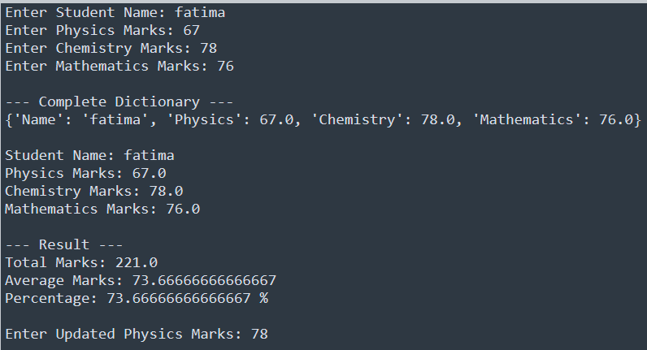

# Task-12

## I learned in lesson
1. Create a set of students enrolled in Python.
2. Create a set of students enrolled in AI.
3. Display both sets.
4. Display all students enrolled in either course.
5. Display students enrolled in both courses.
6. Display students enrolled only in Python.
7. Display students enrolled only in AI.
8. Display the total number of students in each course.
9. Display the total number of unique students.
10. Display the final analysis report.

## Task#12
Course Enrollment Analysis Using Sets

# Output

	
	

	    