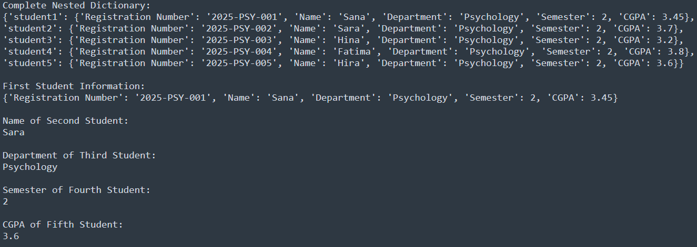

# Task-14

## I learned in lesson
1. Create a nested dictionary named students.
2. Store information for 5 students. Each student should contain:

   * Registration Number
   * Name
   * Department
   * Semester
   * CGPA
3. Display the complete nested dictionary.
4. Display the complete information of the first student.
5. Display the name of the second student.
6. Display the department of the third student.
7. Display the semester of the fourth student.
8. Display the CGPA of the fifth student.
9. Update the CGPA of any one student.
10. Add a new field *University* to any student.
11. Remove the *University* field.
12. Display the keys and values of the first student's record.
13. Display the final updated nested dictionary.

## Task#14
College Student Records Using Nested Dictionaries

# Output

   
   

