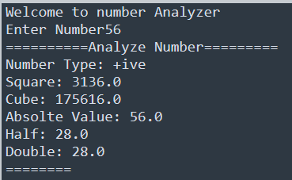

# TAsk-15

## I learned in lesson
1 Display a welcome message.
2️ Take a number as input from the user.
3️ Check whether the number is:

* Positive
* Negative
* Zero
4 Display the entered number.
5 Display the square of the number.
6 Display the cube of the number.
7️ Display the absolute value of the number.
8️ If the number is positive, also display:
* Half of the number
* Double of the number
9️ Display all results in a well-formatted output report.

## Task#15
Number Analyzer Using If Statement

# Output

	
	

