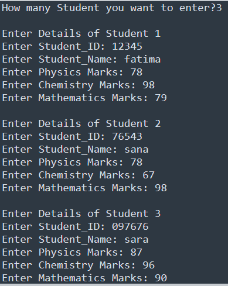

# Task-17

## I learned in lesson
1. Ask the user how many students they want to enter.
2. Use a while loop to enter the record of each student.
3. Take the following inputs:
   • Student ID
   • Student Name
   • Physics Marks
   • Chemistry Marks
   • Mathematics Marks

4. Calculate:
   • Total Marks
   • Average Marks
   • Percentage
5. Store each student's record in a dictionary.
6. Store all student records in a list.
7. After all entries are completed:
   • Display the complete record of all students.
   • Display the total number of students entered.
   
## Task#17
Student Marks Entry Using While Loop

# Output

   

   

