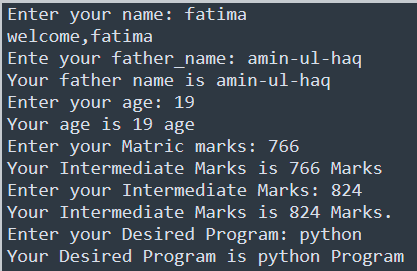

# Task-3

## I learned in lesson
- Comments
- Naming Rules
- Multiple Variables
- Data Types (integer, float, string, boolean)
- Type()Function
- Type casting and user input
- Welcome

## task#3
Display a Welcome Massage

# Output

	

