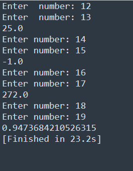

# Task-4

## I learned in lesson
- Ask the user to enter the first number.
- Ask the user to enter the second number.
- display:
-      ->Sum of the numbers
-        ->Difference of the numbers
-       ->Product of the numbers
-        ->division of the numbers

## Task#4
Build a Simple Calculator

# Output

	

