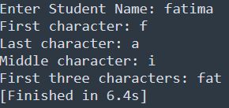

# Task-5.1

## I learned in lesson
- Takes a student's name as input.
- Prints:
*First character
*Last character
*Middle character
- Prints the first three characters of the name.

## Task#5.1
Student Name Ananlyzer

# Output

	

	