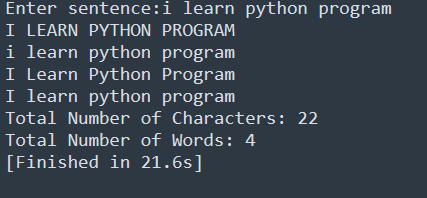

# Task-5.2

## I learned in lesson
1. Takes a sentence as input.
2. Displays the sentence in:

   * Uppercase
   * Lowercase
   * Title Case
   * Capitalized Form
3. Prints:

   * Total number of characters
   * Total number of words

## Task#5.2
Text Case Converter

# Output   

   
  
 