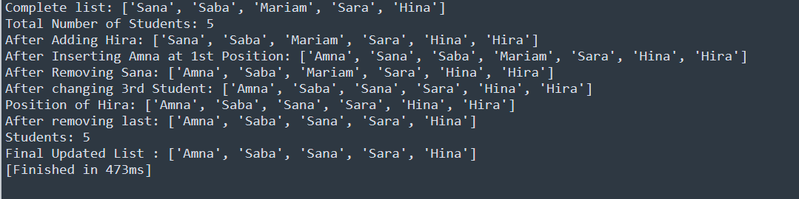

# Task-7

## I learned in lesson
- Create a list named students containing 5 student names.
- Display the complete list.
- Add a new student to the list.
- Add another student at the beginning of the list.
- Change the name of the third student.
- Remove one student from the list.
- Remove the last student from the list.
- Find and display the position of a specific student.
- Display the total number of students in the list.
- Display the final updated list.
## Task#7
Student List Managment

# Output

	

	