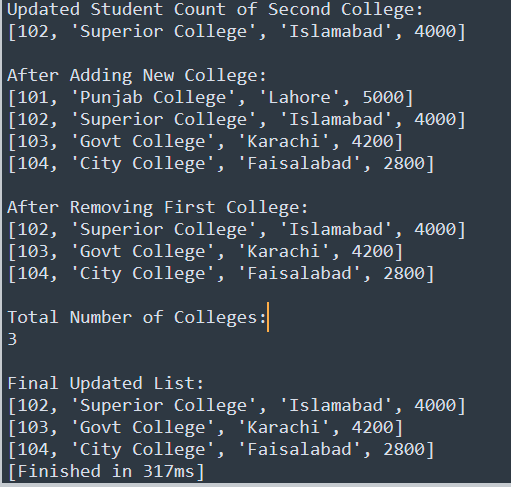

# Task-8

## I learned in lesson
1. Create a nested list named "colleges".
2. Store information for at least 3 colleges:
   - College ID
   - College Name
   - City
   - Total Students
3. Display the complete list of colleges.
4. Display the details of the first college.
5. Display the name of the second college.
6. Display the city of the third college.
7. Update the total number of students for any college.
8. Add a new college record.
9. Remove a college record.
10. Display the total number of colleges.
11. Display the final updated list.

## Task#8
College Information Managment(Nisted List)

# Output

   
  

   

